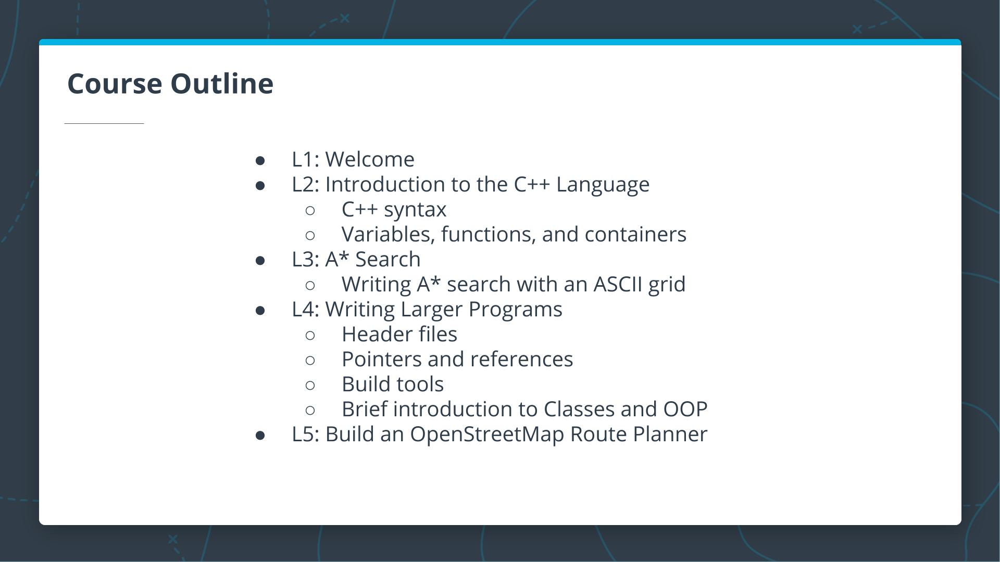
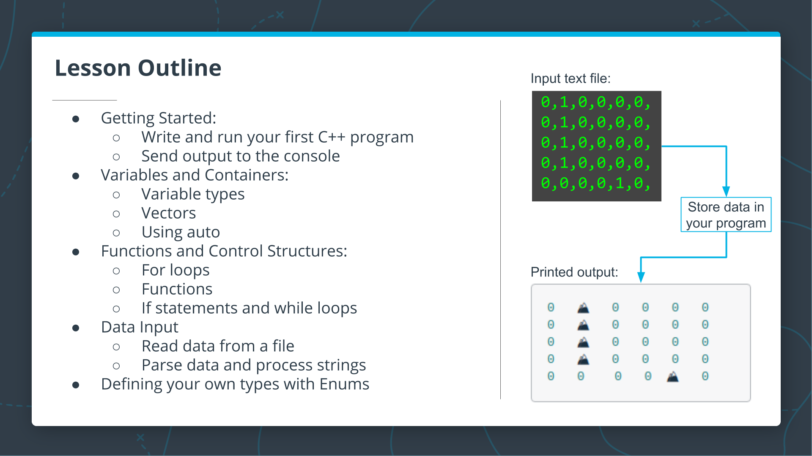
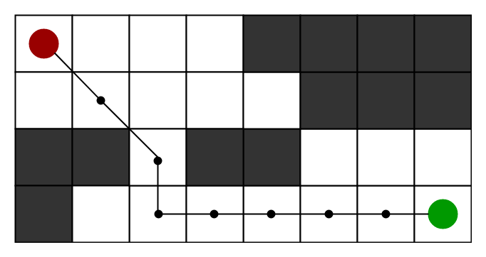
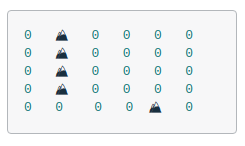
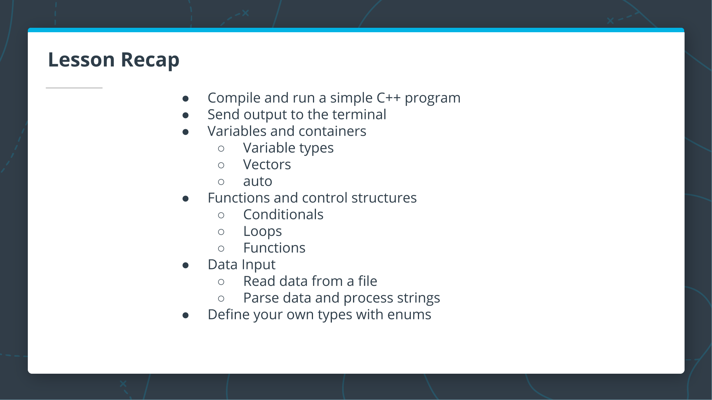
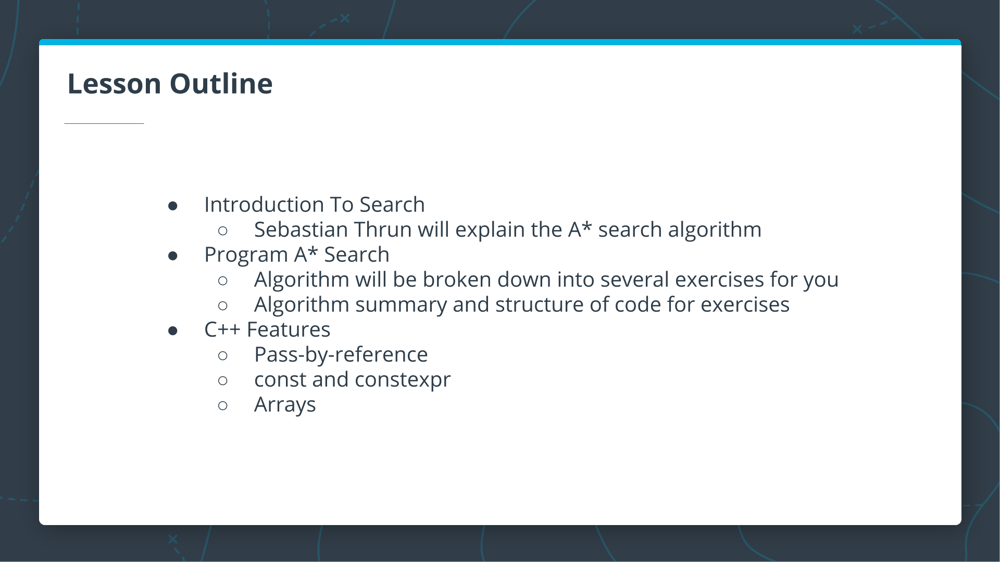
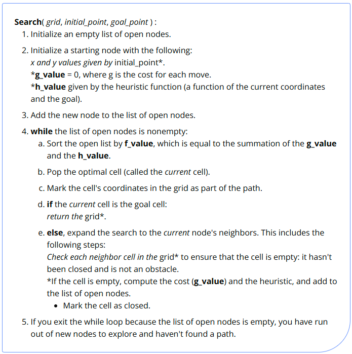

# 1. Welcome

[Welcome to C++ Foudations](https://www.youtube.com/watch?v=PbiTuU2sm08)

[What is C++?](https://youtu.be/tXg6TiANbA4)

[Why Learn C++?](https://youtu.be/5YqXKix5iwM)

[What's Different About C++?](https://youtu.be/qUNRDSeM4uA)

[Where is C++ Used?](https://youtu.be/mosm1Orkn_U)

[Why Is C++ the Choice for Industry?](https://youtu.be/w6NXX9JyBhM)

# 2. Introduction to the C++ Langauge

[Lesson Outline](https://youtu.be/AMXGJ68Tng4)

C++ is a compiled language; there is a separate program - the compiler - that converts your code to an executable program that the computer can run. This means that running a new C++ program is normally a two step process:
- Compile your code with a compiler.
- Run the executable file that the compiler outputs.

## Compiled Languages vs Scripted Languages

You might be wondering why one might use a compiled language. What are the advantages and disadvantages?
In the next couple of videos, Bjarne compares compiled and scripted languages and discusses some of the advantages and disadvantages of each:
+ [Advantages and Disadvantages of Compiled Languages](https://youtu.be/lLdYFFIyc60)
+ [Advantages of a Dynamically Scripted Language](https://youtu.be/DedCGNJAZQY)

## C++ Output and Language Basics

[C++ Output and Language Basics](./Notebook/C++%20Output%20and%20Language%20Basics.ipynb)

## C++ Types Introduction

C++ uses variables, just as in nearly every other programming language. Unlike some other languages, however, in C++ each variable has a fixed type. When a new variable is "declared", or introduced in a program, the program author must (usually) specify the variable type in the declaration.

[C++ Types Introduction](https://youtu.be/2tuTBl584ow)

[Primitive Variable Types](./Notebook/Primitive%20Variable%20Types.ipynb)

[What is a Vector?](https://youtu.be/AfwagT0JJO0)

[How to declare and store a vector containing primitive types](./Notebook/C++%20Vectors.ipynb)

You have now seen how to store basic types and vectors containing those types. As you practiced declaring variables, in each case you indicated the type of the variable. It is possible for C++ to do automatic type inference, using the `auto` keyword.

[Using `Auto`](./Notebook/Using%20Auto.ipynb)

> **CODE: Store a Grid in Your Program**\
> In order to write the A* search algorithm, you will need a grid or "board" to search through. We'll be working with this board throughout the remaining exercises, and we'll start by storing a hard-coded board in the main function. In later exercises, you will write code to read the board from a file.
> \
> **To Complete This Exercise**: In the `main` function, declare a variable board as a vector of vectors of ints: `vector<vector<int>>`.\
> [Solution](./Notebook/Store%20a%20Grid%20in%20Your%20Program.cpp)

[Working with Vectors](./Notebook/Working%20with%20Vectors.ipynb)

[For Loops](./Notebook/For%20Loops.ipynb)

[Functions](./Notebook/Functions.ipynb)

> **CODE: Print the Board**\
> Now that you have a board stored in your program, you'll need a way to print it out so you can display the results of your project. In this exercise, you will add a `PrintBoard` function to print the board one row at a time.\
> **_To Complete This Exercise_**: Write a void `PrintBoard` function. The function should accept the board as an argument. The function should print each row of the board with a newline `"\n"`.\
> [Solution](./Notebook/Print%20the%20Board.cpp)

Now that you are able to print the board in your program, you will make the program more flexible by reading the board from a file. This will allow you to run your program with different board files to see the results.

Before you can read the contents of a file into your program, you'll need to learn the syntax for just a couple more parts of the C++ language: `if` statements and `while` loops.

[If Statements and While Loops](./Notebook/If%20Statements%20and%20While%20Loops.ipynb)

[Reading from a File](./Notebook/Reading%20from%20a%20File.ipynb)

> **CODE: Read the Board from a File**\
> Until now, the board has been declared and initialized in the `main()` function. As discussed in the previous notebook, you will need a function to read the board in from another file in order to make the program a little more flexible and user-friendly.\
> The first step in this process will be to write a `ReadBoardFile` function that reads in the file and prints each line to `cout`. The output should look like the [`1.board`](./Notebook/1.board) file\
> **_To Complete This Exercise_**: Write a function void `ReadBoardFile` which reads lines from a file. Write each line to `cout`, followed by a newline character `"\n"`. The function should accept a string argument, which represents the path to the file. For now, since `ReadBoardFile` does not need to return anything, you can use a `void` return type.\
> **_Note_**: you will need to include the `fstream` class, and you may want to have `using std::ifstream` to use the `ifstream` object without having to write `std::` in the rest of your code.\
> [Solution](./Notebook/Read%20the%20Board%20from%20a%20File.cpp)

Now that the board is being read into your program line by line, you will want to process each line and store the data, rather than just streaming it to `cout`. There are many ways to do this in C++, but we will focus on `istringstream` from the `<sstream>` header file.

[Processing Strings](./Notebook/Processing%20Strings.ipynb)

[Adding Data to a Vector](./Notebook/Adding%20Data%20to%20a%20Vector.ipynb)

> **CODE: Parse Lines from the File**\
> Now that you are able to read a board line by line from a file, you will want to parse these lines and store them in a `vector<int>`. In this exercise, you will focus on a helper function to do this string parsing.\
> **_To Complete This Exercise_**: Write a `vector<int> ParseLine` function which accepts a string as an argument. Use `std::istringstream` to parse the line by comma `char`s, and store the `int`s in a `vector<int>`. `ParseLine` should return the vector after parsing.\
> **_Note_**: You will need to `#include <sstream>` to use `istringstream`. Additionally, you may want to add using std::istringstream; to your program. Finally, remember that each line of the board will look something like: `1,0,0,0,0,`, so you may want to stream an `int` and a `char` with each pass through a while loop.\
> [Solution](./Notebook/Parse%20Lines%20from%20the%20File.cpp)

> **CODE: Use the ParseLine Function**\
> With the `ParseLine` function complete, you can now use it in the `ReadBoardFile` to process each line of the incoming file. In this exercise, you will do just that: follow the TODOs in the code below, updating both `ReadBoardFile` and the `main` function to finish the processing of an external board file.\
> **_To Complete This Exercise_**: Update `ReadBoardFile` to use `ParseLine` and return the board as a `vector<vector<int>>`. You can read the TODO comments in the code for step by step instructions.\
> [Solution](./Notebook/Use%20the%20ParseLine%20Function.cpp)

In the previous exercises, you stored and printed the board as a vector<vector<int>>, where only two states were used for each cell: 0 and 1. This is a great way to get started, but as the program becomes more complicated, there will be more than two possible states for each cell. Additionally, it would be nice to print the board in a way that clearly indicates open areas and obstacles, just as the board is printed below.

To do this clearly in your code, you will learn about and use something called an `enum`. An `enum`, short for enumerator, is a way to define a type in C++ with values that are restricted to a fixed range. For an explanation and examples, see the notebook below:
- [Formatting the Printed Board](./Notebook/Formatting%20the%20Printed%20Board.ipynb)

> **CODE: Formatting the Printed Board**\
> The board will eventually have more than two cell states as the program becomes more complicated, and it would be nice to add formatting to the printed output of the board to ensure readability as the number of board states increases.\
> To accommodate more board states and facilitate print formatting, we have provided the `State` enum with enumerator values `kEmpty` and `kObstacle`. In this exercise, you will write a `CellString` function which converts each `State` to an appropriate string. In the next exercise, we will update the program to use the `enum` values and `CellString` function.
> **_To Complete This Exercise_**: Write a function CellString which accepts aState as input and returns the following string:
> - `"⛰️ "`if the input equals a `kObstacle`
> - `"0 "` otherwise.
>
> [Solution](./Notebook/Formatting%20the%20Printed%20Board.cpp)

> **CODE: Store the Board using the State Enum**\
> Now that you have a way to print the `State` `enum` values, you will be able to modify your program to use `State` values in the board exclusively. To do this, you will need to modify the return types and variable types in several places of the code. Don't worry, as we have clearly marked these with a `TODO` in each part of the code.\
> **_To Complete This Exercise_**: Follow the `TODO` comments in the `main` file below, and update the program to store a board of `State` variables. When you are done, the board should print as in the image above. Note that you will need to call `CellString` on each object in the board before printing: `CellString(board[i][j])`.\
> [Solution](./Notebook/Store%20the%20Board%20using%20the%20State%20Enum.cpp)

## Lesson Recap

You now have a C++ program which reads board data, stores the board in your program, and prints the board with nice formatting. You are ready to begin writing the A* search function.

# 3. A* Search

[Lesson Outline](https://youtu.be/XlEVpwKHkMY)

[Motion Planning Concept](https://youtu.be/KHAu5A_flcQ)

[Coding the Shortest Path Algorithm](https://youtu.be/pqJTVPls-k0)

[A* Search Overview](https://youtu.be/lxCCtgHk5Vs)

The `A* search` algorithm finds a path from the start node to the end node by checking for open neighbors of the current node, computing a heuristic for each of the neighbors, and adding those neighbors to the list of open nodes to explore next. The next node to explore is the one with the lowest total cost + heuristic (g + h). This process is repeated until the end is found, as long as there are still open nodes to explore.

This algorithm described by Sebastian is very similar to other search algorithms you may have seen before, such as `breadth-first search`, except for the additional step of computing a heuristic and using that heuristic (in addition to the cost) to find the next node.

The following is the pseudocode for the algorithm described in the video above. Although the pseudocode shows the complete algorithm in a single function, we will split parts of the algorithm into separate functions in this lesson so you can implement them step-by-step in a sequence of exercises:

[A* Code Structure](https://youtu.be/ItIdjPEhHdg)

The code for the A* search algorithm has been broken down into the following functions:
- `CellSort()` - sorts the open list according to the sum of h + g
- `ExpandNeighbors()` - loops through the current node's neighbors and calls appropriate functions to add neighbors to the open list
- `CheckValidCell()` - ensures that the potential neighbor coordinates are on the grid and that the cell is open
- `Heuristic()` - computes the distance to the goal
- `AddToOpen()` - adds the node to the open list and marks the grid cell as closed

You will be implementing these functions along with a few other small helper functions throughout the rest of this lesson to complete the ASCII A* search program.

